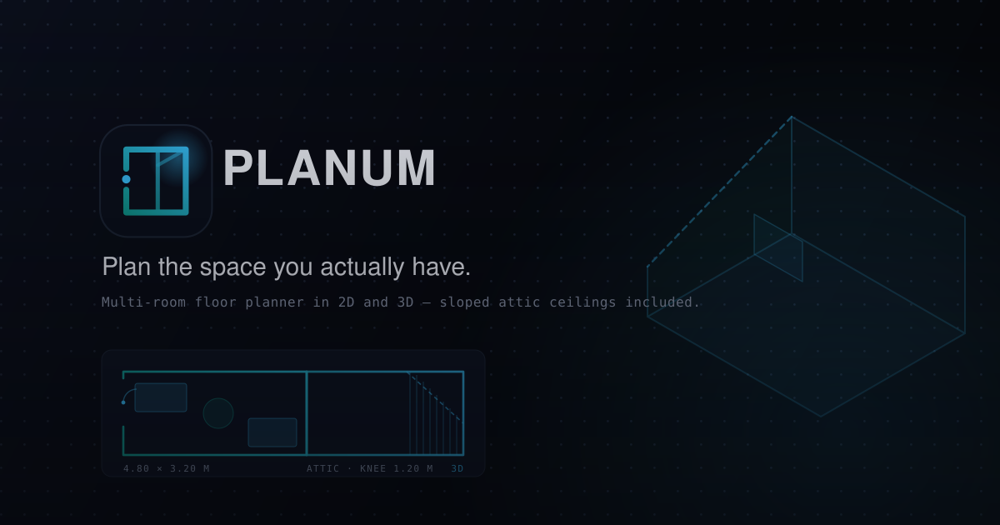

<p align="center">
  
</p>

# PLANUM

**Plan the space you actually have.**

A floor planner for real homes — the ones with an attic bedroom whose ceiling
drops to 1.2 m along one wall, a hallway that bends around a corner, and a
wardrobe you need to know will actually fit. Lay rooms out on a 2D canvas,
walk through them in 3D, and furnish them from a catalog that knows its own
real-world dimensions. English and German, everything stored in your own
browser.

## Features

- **Sloped ceilings, described the way you'd measure them** — a slope is
  attached to a *wall*, not modelled as roof geometry: a knee-wall height
  ("Kniestock") and a horizontal run into the room. Two numbers you can take
  with a tape measure. PLANUM then flags every placed item that no longer
  fits under the resulting ceiling — the thing a flat 2D floor plan can
  never tell you.
- **The same room in 2D and 3D** — a top-down canvas for precise placement,
  and a Three.js walkthrough for what it will actually feel like. One
  layout, two views, no separate "3D mode" file.
- **Rooms that aren't rectangles** — rectangle, L, T, U and cut-corner
  templates, plus constrained wall-dragging to match a real floor plan.
  Hallways get their own straight/L/T shape family for corridors bending
  around a corner.
- **Homes → floors → rooms** — a Home owns any number of floors, a floor owns
  rooms placed relative to each other. A single standalone room with no
  building around it is its own first-class thing, not a one-room floor in
  disguise. Both kinds sit on the dashboard.
- **Adjacent rooms open into each other** — push two rooms flush together in
  the multi-room overview and PLANUM works out which span of wall they share,
  then offers to open exactly that span on both sides. So a complicated
  layout can be composed from several simple rooms instead of one gnarly
  polygon. Openness is per-interval, not per-wall: a short room touching one
  end of a long neighbour only opens the part it actually touches.
- **208 furniture presets across 18 categories** — kitchen, bathroom,
  office, kids, garage, outdoor, pets and more. 114 of them render as real
  low-poly 3D models (Kenney Furniture Kit); most of the rest have
  hand-written procedural geometry so the 3D view isn't a field of plain
  boxes.
- **A built-in IKEA catalog** — 33 common beds, shelving units, tables and
  seats at their real published dimensions, so furniture you already own goes
  in at the right size instead of being eyeballed.
- **My Own Catalog** — recolour and resize a placed item, then save it for
  reuse. Saved items get their own tab, their own JSON export/import, and can
  optionally ride along inside a room or floor export. Re-importing the same
  file twice never duplicates anything.
- **Doors, windows and terrace doors** — each with real heights measured from
  the floor (a window sits on a 90 cm sill, a terrace door is floor-length),
  which is what makes them differ in the 3D view rather than just in name.
- **Item layers** — rugs sit under everything, lamps and laptops settle on
  top of the desk you drop them on, sconces and art mount to a wall at a
  fixed height. Only floor-standing furniture collides; the rest is free.
- **Flooring that renders in both views** — a family × pattern catalog
  (planks, tiles, fibre) drawn as SVG in 2D and as a generated texture in 3D,
  recoloured per room.
- **English and German throughout** — including the catalog, which carries
  both names for every item.
- **Undo/redo, multi-select marquee, collision checking** — collision is on
  by default and can be switched off per session when you need to cheat.

## Getting started

```bash
npm install
npm run dev
```

| Command                             | What it does                                    |
| ----------------------------------- | ----------------------------------------------- |
| `npm run dev`                       | Vite dev server.                                 |
| `npm run build`                     | Production build.                                |
| `npm test`                          | Test suite — `node:test`, no framework dependency.|
| `npm run lint`                      | ESLint.                                          |
| `npx tsc --noEmit -p tsconfig.json` | Type-check.                                      |

## How sloped ceilings work

An attic room isn't a box, and that is the entire reason to plan one. A
slope is stored against a wall as `{ kneeHeight, run }`: the ceiling starts
at `kneeHeight` where it meets that wall and rises to the room's full height
over `run` centimetres measured perpendicular into the room.

The floor polygon is never touched by this — footprint, collision and
furniture clamping all stay exactly as they are for a plain rectangular
room. What the slope changes is the *available height* at a given point,
which is what `checkItemFitsUnderSlopes` uses to tell you that a 200 cm
wardrobe cannot stand where the ceiling is 120 cm.

`src/lib/wall-slopes.ts` has the full reasoning; `docs/LEARNINGS.md` covers
how it interacts with the canvas and the 3D renderer.

## Where your data lives

Everything is in `localStorage` — no account, no server, no sync. The keys:

| Key                          | Holds                                          |
| ---------------------------- | ---------------------------------------------- |
| `planner-homes-v1`           | Homes, each with its floors and rooms.          |
| `planner-single-rooms`       | Standalone rooms with no building around them.  |
| `planner-custom-catalog-v1`  | "My Own Catalog" saved items.                   |
| `planner-settings-v1`        | Language, default view/zoom, collision default. |
| `planner-theme`              | Light/dark.                                     |

Two older key generations (`planner-multi-floors`, `planner-multi-rooms`) are
still read as migration sources, so a returning user's old layouts are picked
up rather than lost. Migration is non-destructive — see `src/lib/homes.ts`.

Every room, floor and home can be exported to JSON and imported back, which
is the intended way to move between browsers or devices.

## Tech stack

- **App**: TanStack Start + TanStack Router, React 19, TypeScript, Vite 7.
- **3D**: Three.js, with `.glb` kit models plus procedural geometry.
- **UI**: Tailwind CSS v4, Radix primitives (shadcn-style), lucide-react,
  sonner.
- **Validation**: Zod, on every import path.
- **Tests**: `node:test` via `--experimental-strip-types` — no test framework.

## Project structure

```
room-play-space/
├── brand/                  standalone brand assets (logo, favicon, banner)
├── src/
│   ├── routes/             dashboard, /room/$roomId, /home/$homeId/room/$roomId…
│   ├── components/
│   │   ├── dashboard/      Dashboard, HomesList, SingleRoomsList, create flows
│   │   ├── planner/
│   │   │   ├── canvas/     CanvasArea, CanvasItems, CanvasSlopes, CanvasRuler…
│   │   │   ├── sidebar/    catalog, My Catalog, inspector, openings dialogs
│   │   │   ├── ThreeDView.tsx        the 3D walkthrough
│   │   │   └── MultiRoomCanvas.tsx   the floor overview
│   │   ├── room-creation/  IKEA-style room wizard + shape canvas
│   │   └── ui/             shadcn primitives
│   ├── lib/
│   │   ├── planner-math.ts       collision, clamping, on-top elevation
│   │   ├── wall-slopes.ts        sloped-ceiling geometry + fit checks
│   │   ├── hallway-shapes.ts     N-corner polygon helpers, wall indexing
│   │   ├── room-shapes.ts        L/T/U/cut-corner templates, wall dragging
│   │   ├── room-adjacency.ts     shared-wall detection between rooms
│   │   ├── planner-presets.ts    the 208-item catalog
│   │   ├── ikea-catalog.ts       33 real IKEA items
│   │   ├── procedural-models.ts  3D geometry for presets with no .glb
│   │   ├── homes.ts / floors.ts / single-rooms.ts   persistence + migration
│   │   └── planner-translations.ts  EN/DE strings
│   ├── hooks/use-room-planner.ts    the planner state machine
│   └── types/planner.ts
├── tests/                  26 test files covering the geometry and
│                           persistence libs
├── docs/LEARNINGS.md       the geometry/rendering write-up — read before
│                           touching planner-math, hallway-shapes, ThreeDView
├── entry.js                Bun.serve shim for self-hosting (see below)
└── Dockerfile
```

## Deploying

The Cloudflare Vite plugin is used at **build time only**. `bun run build`
produces a Worker bundle, and `entry.js` serves it with `Bun.serve` instead
of `workerd` — consumer NAS CPUs often lack the instruction sets `workerd`
needs, so the default preview server crashes on them.

```bash
docker build -t planum . && docker run -d -p 3000:3000 --name planum planum
```

Pushes to the `release` branch also build a multi-arch image and publish it
to `ghcr.io/ewolution94/room-play-space:latest`, which is what the Portainer
stack on the NAS pulls.

`NAS_DEPLOYMENT.md` documents the whole arrangement, including the SSR
error-interception shim that stops TanStack Start from swallowing loader
stack traces into a generic `{"unhandled":true}` JSON payload.

## What this deliberately doesn't do

- **No account, no backend, no sync.** Layouts live in your browser.
  Export/import JSON is the migration path, on purpose.
- **No magnetic snapping yet** — items clamp to the room and collide, but
  they don't snap to grid lines, walls or each other. It's on the backlog in
  `todo.md`.
- **No PDF blueprint or shareable-link export** — also backlog, not built.
- **Furniture clamps to the room's bounding box**, not to the exact concave
  outline of an L- or T-shaped room, so it's possible to place something in
  the notch. A deliberate simplification; see the comment in `planner-math.ts`.
- **Mobile is view-only** for multi-room overviews — you can look, pan and
  zoom, but editing a floor plan on a phone isn't a thing PLANUM pretends to
  do well.
