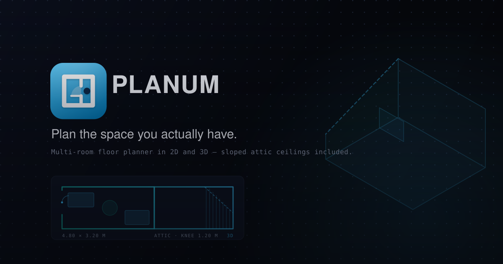

<p align="center">
  
</p>

# PLANUM

**Plan the space you actually have.**

A floor planner for real homes — the ones with an attic bedroom whose ceiling
drops to 1.2 m along one wall, a hallway that bends around a corner, and a
wardrobe you need to know will actually fit. Lay rooms out on a 2D canvas,
walk through them in 3D, and furnish them from a catalog that knows its own
real-world dimensions. English and German, everything stored in your own
browser.

## Features

- **Sloped ceilings, described the way you'd measure them** — a slope is
  attached to a *wall*, not modelled as roof geometry: a knee-wall height
  ("Kniestock") and a horizontal run into the room. Two numbers you can take
  with a tape measure. PLANUM then flags every placed item that no longer
  fits under the resulting ceiling — the thing a flat 2D floor plan can
  never tell you.
- **The same room in 2D and 3D** — a top-down canvas for precise placement,
  and a Three.js walkthrough for what it will actually feel like. One
  layout, two views, no separate "3D mode" file.
- **Rooms that aren't rectangles** — rectangle, L, T, U and cut-corner
  templates, plus constrained wall-dragging to match a real floor plan.
  Hallways get their own straight/L/T shape family for corridors bending
  around a corner.
- **Homes → floors → rooms** — a Home owns any number of floors, a floor owns
  rooms placed relative to each other. A single standalone room with no
  building around it is its own first-class thing, not a one-room floor in
  disguise. Both kinds sit on the dashboard.
- **Adjacent rooms open into each other** — push two rooms flush together in
  the multi-room overview and PLANUM works out which span of wall they share,
  then offers to open exactly that span on both sides. So a complicated
  layout can be composed from several simple rooms instead of one gnarly
  polygon. Openness is per-interval, not per-wall: a short room touching one
  end of a long neighbour only opens the part it actually touches.
- **208 furniture presets across 18 categories** — kitchen, bathroom,
  office, kids, garage, outdoor, pets and more. 114 of them render as real
  low-poly 3D models (Kenney Furniture Kit); most of the rest have
  hand-written procedural geometry so the 3D view isn't a field of plain
  boxes.
- **A built-in IKEA catalog** — 33 common beds, shelving units, tables and
  seats at their real published dimensions, so furniture you already own goes
  in at the right size instead of being eyeballed.
- **My Own Catalog** — recolour and resize a placed item, then save it for
  reuse. Saved items get their own tab, their own JSON export/import, and can
  optionally ride along inside a room or floor export. Re-importing the same
  file twice never duplicates anything.
- **Doors, windows and terrace doors** — each with real heights measured from
  the floor (a window sits on a 90 cm sill, a terrace door is floor-length),
  which is what makes them differ in the 3D view rather than just in name.
- **Item layers** — rugs sit under everything, lamps and laptops settle on
  top of the desk you drop them on, sconces and art mount to a wall at a
  fixed height. Only floor-standing furniture collides; the rest is free.
- **Flooring that renders in both views** — a family × pattern catalog
  (planks, tiles, fibre) drawn as SVG in 2D and as a generated texture in 3D,
  recoloured per room.
- **English and German throughout** — including the catalog, which carries
  both names for every item.
- **Undo/redo, multi-select marquee, collision checking** — collision is on
  by default and can be switched off per session when you need to cheat.
- **Snapping while you drag** — an item's edges and centre snap to the walls
  and to other items' edges and centres, with a guide line, and rotation eases
  onto right angles. Hold Shift for a 5 cm grid and 15° steps, Alt (⌥) to
  place freely; "Snap to Walls & Items" in the 2D view options turns it off.
- **Warnings for what's in the way** — items that overlap (with collision off),
  stand in a door's swing, or reach above the sill right in front of a window
  get a red outline, and the door or window turns red, on the plan and in the
  Elements list. Rugs, and things sitting on other furniture, don't count.
- **Installs to a home screen, and works without a connection** — a web
  manifest, icons and a service worker. Since the plans live in the browser
  anyway, the whole app (3D view and furniture models included) is cached,
  so it opens full-screen like an app and keeps working offline.

## Getting started

```bash
npm install
npm run dev
```

| Command                             | What it does                                    |
| ----------------------------------- | ----------------------------------------------- |
| `npm run dev`                       | Vite dev server on port 8080.                    |
| `npm run build`                     | Production build.                                |
| `npm test`                          | Test suite — `node:test`, no framework dependency.|
| `npm run lint`                      | ESLint.                                          |
| `npx tsc --noEmit -p tsconfig.json` | Type-check.                                      |

## How sloped ceilings work

An attic room isn't a box, and that is the entire reason to plan one. A
slope is stored against a wall as `{ kneeHeight, run }`: the ceiling starts
at `kneeHeight` where it meets that wall and rises to the room's full height
over `run` centimetres measured perpendicular into the room.

The floor polygon is never touched by this — footprint, collision and
furniture clamping all stay exactly as they are for a plain rectangular
room. What the slope changes is the *available height* at a given point,
which is what `checkItemFitsUnderSlopes` uses to tell you that a 200 cm
wardrobe cannot stand where the ceiling is 120 cm.

`src/lib/wall-slopes.ts` has the full reasoning; `docs/LEARNINGS.md` covers
how it interacts with the canvas and the 3D renderer.

## Where your data lives

Everything is in `localStorage` — no account, no server, no sync. The keys:

| Key                          | Holds                                          |
| ---------------------------- | ---------------------------------------------- |
| `planner-homes-v1`           | Homes, each with its floors and rooms.          |
| `planner-single-rooms`       | Standalone rooms with no building around them.  |
| `planner-custom-catalog-v1`  | "My Own Catalog" saved items.                   |
| `planner-settings-v1`        | Language, default view/zoom, collision default. |
| `planner-theme`              | Light/dark.                                     |

Two older key generations (`planner-multi-floors`, `planner-multi-rooms`) are
still read as migration sources, so a returning user's old layouts are picked
up rather than lost. Migration is non-destructive — see `src/lib/homes.ts`.

Every room, floor and home can be exported to JSON and imported back, which
is the intended way to move between browsers or devices.

The offline copy of the app itself sits in the browser's Cache Storage
(`planum-shell-v1`, `planum-assets-v1`), not in `localStorage`: clearing
it costs nothing but the offline start. See `public/sw.js`.

## Tech stack

- **App**: TanStack Start + TanStack Router + TanStack Query, React 19,
  TypeScript, Vite 7.
- **3D**: Three.js, with `.glb` kit models plus procedural geometry.
- **UI**: Tailwind CSS v4, Radix primitives (shadcn-style), lucide-react,
  sonner.
- **Validation**: Zod, on every import path.
- **Tests**: `node:test` via `--experimental-strip-types` — no test framework.

## Project structure

```
room-play-space/
├── brand/                  standalone brand assets (logo, favicon, banner)
├── src/
│   ├── routes/             dashboard, /room/$roomId, /home/$homeId/room/$roomId…
│   │                       (routeTree.gen.ts is generated; rooms.* redirect old links)
│   ├── components/
│   │   ├── dashboard/      Dashboard, HomesList, SingleRoomsList, create flows
│   │   ├── planner/
│   │   │   ├── canvas/     CanvasArea, CanvasItems, CanvasSlopes, CanvasRuler…
│   │   │   ├── sidebar/    catalog, My Catalog, inspector, openings dialogs
│   │   │   ├── ThreeDView.tsx        the 3D walkthrough
│   │   │   └── MultiRoomCanvas.tsx   the floor overview
│   │   ├── room-creation/  IKEA-style room wizard + shape canvas
│   │   └── ui/             shadcn primitives
│   ├── lib/
│   │   ├── planner-math.ts       collision, clamping, on-top elevation
│   │   ├── wall-slopes.ts        sloped-ceiling geometry + fit checks
│   │   ├── hallway-shapes.ts     N-corner polygon helpers, wall indexing
│   │   ├── room-shapes.ts        L/T/U/cut-corner templates, wall dragging
│   │   ├── room-adjacency.ts     shared-wall detection between rooms
│   │   ├── planner-presets.ts    the 208-item catalog
│   │   ├── ikea-catalog.ts       33 real IKEA items
│   │   ├── procedural-models.ts  3D geometry for presets with no .glb
│   │   ├── homes.ts / floors.ts / single-rooms.ts   persistence + migration
│   │   └── planner-translations.ts  EN/DE strings
│   ├── hooks/use-room-planner.ts    the planner state machine
│   └── types/planner.ts
├── tests/                  node:test files covering the lib modules (geometry,
│                           persistence, catalogs); no UI or drag tests
├── docs/LEARNINGS.md       the geometry/rendering write-up — read before
│                           touching planner-math, hallway-shapes, ThreeDView
├── docs/*-PROPOSAL.md      the design write-ups for homes and sloped walls
├── public/models/          the .glb models the app loads; the raw Kenney kit
│                           they came from isn't in git (/resources/ is ignored)
├── todo.md, AUDIT.md       changelog + backlog ("Still open" near the end);
│                           the July 2026 codebase audit
├── entry.js                Bun.serve shim for self-hosting (see below)
└── Dockerfile
```

## Deploying

The Cloudflare Vite plugin is used at **build time only**. `bun run build`
produces a Worker bundle, and `entry.js` serves it with `Bun.serve` instead
of `workerd` — consumer NAS CPUs often lack the instruction sets `workerd`
needs, so the default preview server crashes on them.

`wrangler.jsonc` looks like leftover Cloudflare template config, but it is
what makes that plugin write the server bundle as `dist/server/index.js`, the
file `entry.js` imports. Without it `vite build` still succeeds, writes
`dist/server/server.js` instead, and the container can't start.

```bash
docker build -t planum . && docker run -d -p 3000:3000 --name planum planum
```

Work happens on `release`; `main` is parked. Every push to `release` runs
lint and the tests first (`.github/workflows/docker-publish.yml`), and only
if both pass does it build a multi-arch image and publish it to
`ghcr.io/ewolution94/room-play-space:latest`, which is what the Portainer
stack on the NAS pulls (`deploy/portainer-stack.yml`, kept in sync with the
live one). A push to `release` is a production deploy.

Visits are counted by Census, the self-hosted, cookieless counter: `entry.js`
forwards `/_e.js` and `/_e` to it (`census.js`) when `PLANUM_CENSUS` is set,
and does nothing otherwise. Layouts never leave the browser either way.

`NAS_DEPLOYMENT.md` documents the whole arrangement, including the SSR
error-interception shim that stops TanStack Start from swallowing loader
stack traces into a generic `{"unhandled":true}` JSON payload.

## What this deliberately doesn't do

- **No account, no backend, no sync.** Layouts live in your browser.
  Export/import JSON is the migration path, on purpose.
- **No PDF blueprint or shareable-link export** — also backlog, not built.
- **L/T/U rooms clamp slightly permissively.** Furniture is kept out of the
  notch, but an item big enough to bridge it corner to corner is accepted. A
  deliberate trade-off; see the comment on `clampPos` in `planner-math.ts`.
- **Phones are view-only; tablets edit.** A viewport under 600px on its short
  side (`lib/viewport.ts`) is a phone, in either orientation: the room editor
  and the floor overview let you look, pan and zoom but not edit, and the
  dashboard's create flows that need precise input (a room from scratch, the
  wizard, a new home, a file import) explain why instead of opening. "From
  example" still works. A tablet, portrait included, gets the full editor
  with the sidebar beside a narrower canvas and finger-sized handles. Editing
  a floor plan on a phone isn't a thing PLANUM pretends to do well.
